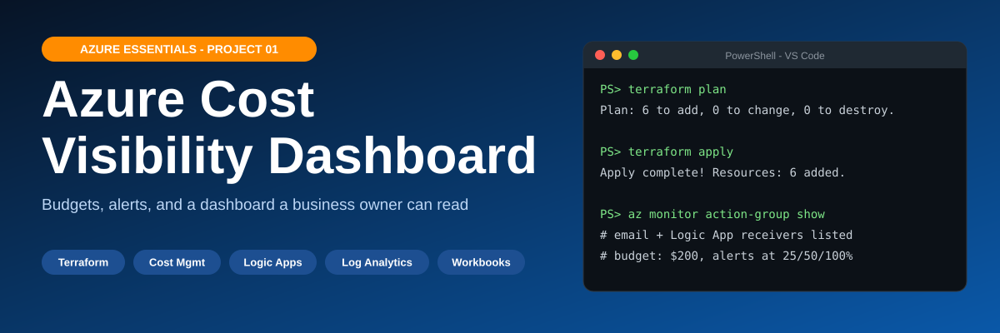

# Azure Essentials - Project 01
# Azure Cost Visibility Dashboard



**# [**Watch Me Build This Lab!**]([Loom link])**

---

## What This Lab Is

Most small businesses move to the cloud and then get bills full of line items nobody can read or predict. This project builds the fix with Terraform: a monthly budget that watches the spend, email alerts at $50, $100, and $200, a Logic App that sends the alert, and a dashboard in Azure Workbooks. The goal is simple. A business owner sees what they are spending and hears about it before the bill is a problem.

## What You Will Build


<details>
<summary>Text version of the diagram</summary>

```
Subscription
  Budget ($200 / month) --> 25% ($50) / 50% ($100) / 100% ($200)
        |
        v
rg-cost-dashboard-giovanni (East US)
  Action Group --> email to owner
        |--> Logic App (HTTP trigger --> Send email)
  Subscription Activity Log --> Diagnostic Setting --> Log Analytics (30 days)
        |
        v
  Azure Workbook (Cost Visibility Dashboard)
```

</details>

## Skills You Will Practice

| Skill | Tool |
|---|---|
| Infrastructure as code | Terraform (azurerm 3.x) |
| Cost control and budgets | Azure Cost Management |
| Alert routing | Azure Monitor Action Groups |
| Low-code automation | Azure Logic Apps |
| Log collection | Diagnostic Settings, Log Analytics |
| Reporting | Azure Workbooks |
| Secure sign-in | Azure CLI device code flow |

## Cost

Close to zero for a short lab. Budgets and action groups are free. Log Analytics bills per GB ingested and Logic Apps bill per run, both tiny at lab scale. Run `terraform destroy` when you finish.

## Time

3 to 4 hours.

## Prerequisites

- An Azure subscription (Owner or Contributor, plus Cost Management access for budgets)
- Terraform, Azure CLI, Git, and VS Code
- An email address for the alerts
- A work or school mailbox if you want to use the Office 365 Outlook step (otherwise use another email connector)

## Quick Start

```powershell
. .\set-vars.ps1
az login --use-device-code
Copy-Item terraform.tfvars.example terraform.tfvars
# edit terraform.tfvars with your email, then:
terraform init
terraform plan
terraform apply
```

Then follow Phases 7 and 8 in [the SOP](docs/Project01-Cost-Dashboard-SOP.md) to build the Logic App steps and the Workbook in the portal.

## Security Flags Applied

| Flag / Setting | Why |
|---|---|
| `terraform.tfvars` in `.gitignore` | Keeps your email out of GitHub |
| Logic App trigger URL never saved | The URL carries a secret signature (`sig=`) |
| `Read-Host -MaskInput` and `--output none` | Hides the URL while pasting and stops `az` printing it back |
| `az login --use-device-code` | No browser popup, no stored tokens in the repo |
| `retention_in_days = 30` | Old log data is deleted automatically |

## Verify It Works

```powershell
az resource list --resource-group $RG --output table
```

Expect the workspace, action group, and Logic App. The budget and diagnostic setting live at subscription level, so check the budget with:

```powershell
az consumption budget show --budget-name $BUDGET --output table
```

Then in the portal, run **Test action group** on `ag-cost-alerts-giovanni` and confirm the email arrives.

## Screenshots

Screenshots are added after the build (budget, action group, Logic App designer, test email, Workbook, and the `terraform apply` output).

## Project Structure

```
azure-cost-dashboard/
├── README.md                      this file
├── main.tf                        all Azure resources
├── variables.tf                   inputs (name, region, email, budget start date)
├── outputs.tf                     values printed after apply
├── terraform.tfvars.example       copy to terraform.tfvars and fill in
├── set-vars.ps1                   names used by the commands
├── .gitignore                     keeps secrets and state out of Git
├── assets/
│   ├── architecture.svg           animated diagram
│   ├── architecture.png           static copy
│   ├── screenshots/               proof screenshots
│   └── thumbnails/                LinkedIn images (detailed and generic sets)
├── linkedin/
│   └── Project01-LinkedIn-Posts.md
└── docs/
    ├── Project01-Cost-Dashboard-SOP.md
    └── Project01-Cost-Dashboard-SOP.docx
```

## Clean Up

List the resource group first. The workbook and the email connection were made by hand in the portal, so Terraform does not know about them. Delete those in the portal, then run:

```powershell
terraform destroy
```

Nothing later in the series depends on this project.

## LinkedIn Post Series

| # | Post | Thumbnail | Generic alternate |
|---|---|---|---|
| 1 | [Watch the walkthrough]([Loom link]) | [post1-loom](assets/thumbnails/png/post1-loom.png) | [g1-watch](assets/thumbnails/generic/png/g1-watch.png) |
| 2 | The GitHub repo | [post2-github](assets/thumbnails/png/post2-github.png) | [g2-github](assets/thumbnails/generic/png/g2-github.png) |
| 3 | One thing I learned | [post3-learned](assets/thumbnails/png/post3-learned.png) | [g3-learned](assets/thumbnails/generic/png/g3-learned.png) |
| 4 | What I'd do differently | [post4-different](assets/thumbnails/png/post4-different.png) | [g4-different](assets/thumbnails/generic/png/g4-different.png) |

## Part of the Azure Essentials Series

| Project | Topic | Repo |
|---|---|---|
| **Project 1** | **Azure Cost Visibility Dashboard** | **[azure-cost-dashboard](https://github.com/Gguerra4networks/azure-cost-dashboard)** |
| Project 2 | Automated Backup System | [Project-2-Automated-Backup-System](https://github.com/Gguerra4networks/Project-2-Automated-Backup-System) |
| Project 3 | Website Uptime Monitor | [project3_uptime_monitor](https://github.com/Gguerra4networks/project3_uptime_monitor) |

## Author

**Giovanni Guerra** - Radio Network Infrastructure Specialist moving into cloud security and federal IT.
[GitHub](https://github.com/Gguerra4networks) | [LinkedIn](https://www.linkedin.com/in/giovanni-giovanni)
